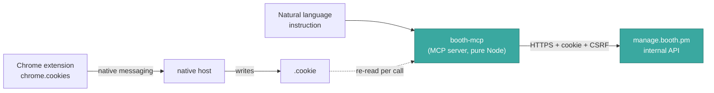

<p align="center"></p>

# booth-mcp

[](LICENSE)
[](https://nodejs.org)
[](https://modelcontextprotocol.io)

> An MCP server that updates your [BOOTH](https://booth.pm) products — description, paragraphs, price,
> downloadable files, images — in seconds, from natural language, with no browser clicking.

*日本語: [README.md](README.md)*

Built to maintain continuously-updated products (apps, tools) on BOOTH without navigating
`manage.booth.pm` by hand. Ask your AI agent (Claude Code etc.)
`"Replace LiveTR's download with v1.4.0.zip and set the price to 500 yen"` and it happens.

## How it works



- **booth-mcp** talks directly to the endpoints the BOOTH management UI uses internally.
  Node's native `fetch` passes Cloudflare's TLS fingerprint gate (Python's httpx/requests get 403).
- **booth-cookie-sync** keeps the httpOnly session cookie in sync automatically, so you never paste it by hand.

## Tools (16)

| Area | Tools |
|---|---|
| Products | `booth_list_items`, `booth_get_item`, `booth_update_item` |
| Paragraphs | `booth_list_paragraphs`, `booth_add_paragraph`, `booth_edit_paragraph`, `booth_delete_paragraph`, `booth_reorder_paragraphs` |
| Pricing | `booth_set_price`, `booth_update_variations` |
| Downloads | `booth_replace_download`, `booth_upload_download`, `booth_delete_download` |
| Images | `booth_upload_image`, `booth_delete_image`, `booth_reorder_images` |

Full argument reference: see the Japanese [README.md](README.md#全16ツール-リファレンス).

## Setup

Requires Node.js 18+, Chrome, and a BOOTH shop account.

```bash
git clone https://github.com/quolu/booth-mcp.git
cd booth-mcp/booth-mcp && npm install
cd .. && cp .mcp.json.example .mcp.json
```

Then provide the session cookie — either automatically (recommended):

```powershell
powershell -ExecutionPolicy Bypass -File booth-cookie-sync/install.ps1
```

…load `booth-cookie-sync/extension` as an unpacked extension in `chrome://extensions`
and **fully restart Chrome** — or manually by copying `booth-mcp/.env.example` to `.env`
and pasting your `_plaza_session_*` cookie.

## Known limitations

- `item_message_for_twitter` (the X/Twitter share text) is **read-only** — the server generates it
  from the product and shop name.
- Creating new products and image cropping are not supported.

## Disclaimer

- **Unofficial.** Not affiliated with pixiv / BOOTH. It uses undocumented internal endpoints,
  so it may break without notice when BOOTH changes.
- Use it **only on shops you own**, and review BOOTH's terms of service yourself.
- It really modifies your live product data — **test on a private/draft product first**.
- Provided as-is with no warranty ([MIT](LICENSE)).

## Security

The session cookie is stored locally in plain text (git-ignored) and sent only to
`https://manage.booth.pm`. See [SECURITY.md](SECURITY.md).
