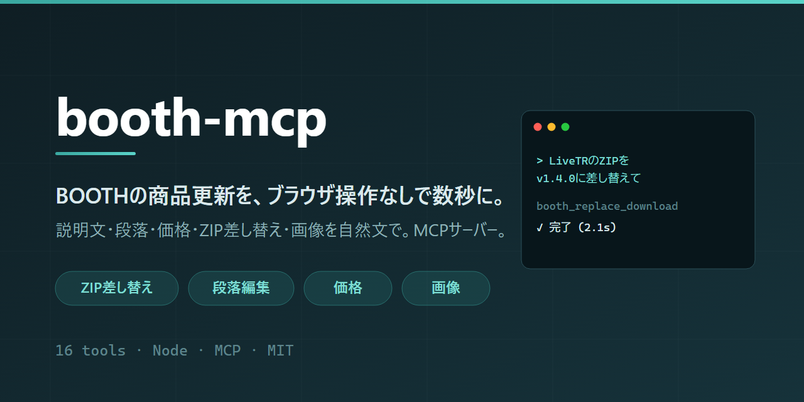
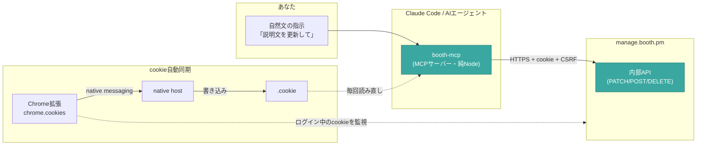

<p align="center"></p>

# booth-mcp

[](LICENSE)
[](https://nodejs.org)
[](https://modelcontextprotocol.io)

> BOOTHの商品更新（説明文・段落・価格・ZIP差し替え・画像）を、ブラウザ操作なしに自然文で頼んで数秒で終わらせるMCPサーバー。

*English: [README.en.md](README.en.md)*

OLTranslator や LiveTR のように継続アップデートする商品を、[manage.booth.pm](https://manage.booth.pm) の
画面をポチポチせずに更新するために作った。AIエージェント（Claude Code等）から `「LiveTRを新バージョンにして、ZIPを差し替え、価格を500円に」`
と頼むだけで、内部APIを直接叩いて反映する。

## 全体像



- **booth-mcp**: BOOTHの内部APIをHTTPで直接叩く。CloudflareのTLSゲートは純Nodeで通過する（Pythonのhttpx/requestsは403で弾かれるが、Nodeは通る）。
- **booth-cookie-sync**: ログイン済みのセッションcookie（httpOnly）をChrome拡張が拾い、`.cookie`へ自動同期。**cookie手貼りが不要**になる。

## 30秒でわかる使用例

MCPサーバーを登録後、AIエージェントにこう頼むだけ：

| 頼むこと | 動くツール |
|---|---|
| 「BOOTHの商品一覧を見せて」 | `booth_list_items` |
| 「LiveTRの新バージョンZIP `C:\...\livetr-v1.4.0.zip` に差し替えて」 | `booth_replace_download` |
| 「OLTranslatorの説明文に『Windows 11対応』の段落を機能一覧の後に追加して」 | `booth_add_paragraph` |
| 「この商品を500円にして」 | `booth_set_price` |
| 「商品画像を1枚追加して、それを先頭（メイン）にして」 | `booth_upload_image` + `booth_reorder_images` |
| 「一旦非公開にして」 | `booth_update_item` (state) |

## 従来（手動ブラウザ操作）との違い

| | 手動 / ブラウザ自動化 | booth-mcp |
|---|---|---|
| 速度 | 画面描画待ちで数十秒〜 | HTTP直叩きで数秒 |
| 安定性 | DOM変化・描画タイミングに弱い | エンドポイント直叩きで安定 |
| 操作 | 毎回クリック・スクロール | 自然文で指示 |
| バージョンアップ | ファイル管理モーダルを開いてD&D | ツール1回 |

## セットアップ

必要なもの: Node.js 18+（native fetch）、Chrome、BOOTHのショップアカウント。

### 1. MCPサーバー

```bash
git clone https://github.com/quolu/booth-mcp.git
cd booth-mcp/booth-mcp && npm install
```

MCPクライアント（Claude Code等）への登録は、リポジトリ直下に `.mcp.json` を置くだけ：

```bash
cp .mcp.json.example .mcp.json
```

### 2. cookieを渡す

**推奨は自動同期**（次項）。手動なら `booth-mcp/.env.example` を `.env` にコピーして
`BOOTH_COOKIE=` にログイン済みcookieを貼る。詳細は [booth-mcp/README.md](booth-mcp/README.md)。

### 3. cookie自動同期（推奨）

```powershell
powershell -ExecutionPolicy Bypass -File booth-cookie-sync/install.ps1
```

そのあと `chrome://extensions` から `booth-cookie-sync/extension` を「パッケージ化されていない拡張機能」として読み込み、
**Chromeを完全に再起動**する。以後ログインし続ける限り、常に有効なcookieで動く。
詳細は [booth-cookie-sync/README.md](booth-cookie-sync/README.md)。

## 全16ツール リファレンス

すべて `item_id`（商品ID）を取る。IDは `booth_list_items` で確認できる。

### 商品情報

| ツール | 引数 | 説明 |
|---|---|---|
| `booth_list_items` | — | 商品一覧（id/名前/状態/価格/URL/画像数/DLファイル） |
| `booth_get_item` | `item_id` | 商品の全データ取得 |
| `booth_update_item` | `item_id`, `name?`, `description?`, `page_design_modules?`, `state?`, `tags?`, `category_id?`, `adult?`, `purchase_limit?`, `preorder_enabled?` | 指定フィールドだけ更新 |

### 段落本文（商品紹介の「段落」）

| ツール | 引数 | 説明 |
|---|---|---|
| `booth_list_paragraphs` | `item_id` | 段落をindex付きで一覧 |
| `booth_add_paragraph` | `item_id`, `title`, `content`, `position?` | 段落を追加（既存は種類問わず保持） |
| `booth_edit_paragraph` | `item_id`, `index`, `title?`, `content?` | 段落を編集 |
| `booth_delete_paragraph` | `item_id`, `index` | 段落を削除 |
| `booth_reorder_paragraphs` | `item_id`, `order` | 段落を並べ替え |

### 価格・在庫

| ツール | 引数 | 説明 |
|---|---|---|
| `booth_set_price` | `item_id`, `price` | 価格変更（item＋全バリエーション連動） |
| `booth_update_variations` | `item_id`, `variations` | バリエーション直接更新（在庫・別価格など） |

### ダウンロードファイル

| ツール | 引数 | 説明 |
|---|---|---|
| `booth_replace_download` | `item_id`, `file_path`, `filename?`, `delete_old?` | **差し替え（バージョンアップ）**＝新規追加＋旧削除 |
| `booth_upload_download` | `item_id`, `file_path`, `filename?` | ファイルを1つ追加 |
| `booth_delete_download` | `item_id`, `downloadable_id` | ファイルを1つ削除 |

### 商品画像

| ツール | 引数 | 説明 |
|---|---|---|
| `booth_upload_image` | `item_id`, `file_path` | 画像を追加（.jpg/.jpeg/.gif/.png） |
| `booth_delete_image` | `item_id`, `image_id` | 画像を削除 |
| `booth_reorder_images` | `item_id`, `image_ids` | 並べ替え（先頭がメインサムネ） |

## できないこと（実測で確認）

- **X共有文（`item_message_for_twitter`）は変更不可** … サーバーが「商品名 | ショップ名」で自動生成する読み取り専用。変えたいなら商品名かショップ名を変える。
- 商品の**新規作成**、画像の**トリミング指定**は未対応（スコープ外）。

## トラブルシューティング

<details>
<summary>cookieが無効/ログイン切れと言われる</summary>

セッションcookieが失効している。ブラウザで manage.booth.pm に再ログインすれば、
cookie自動同期を入れていれば `.cookie` が更新されて自動復帰する。
手貼り運用の場合は `booth-mcp/.env` の `BOOTH_COOKIE` を取り直す。
</details>

<details>
<summary>拡張が同期しない / 「Specified native messaging host not found」</summary>

ネイティブホスト登録より前からChromeが起動していると、Chromeが登録を認識していない。
**Chromeを完全に終了して起動し直す**（タスクマネージャーで `chrome.exe` が残っていないか確認）。
起動時に自動同期が走り、`booth-cookie-sync/host/sync.log` に記録される。
</details>

<details>
<summary>画像アップロードがエラーになる</summary>

極端に小さい画像はBOOTH側が拒否する（"Failed to manipulate, maybe it is not an image?"）。
十分なサイズ（推奨620px以上）の .jpg/.jpeg/.gif/.png を使う。
</details>

<details>
<summary>段落を更新したのに反映されない</summary>

`page_design` は内部的にJSON文字列で送らないと保存されない仕様。booth-mcpは対応済み
（`booth_add_paragraph` 等を使えば問題ない）。生のPATCHを自作する場合の注意点は
[docs/booth-internal-api.md](docs/booth-internal-api.md) を参照。
</details>

## 内部API仕様

偵察で解明したBOOTHの内部APIエンドポイント・罠は [docs/booth-internal-api.md](docs/booth-internal-api.md) にまとめてある。

## 免責・注意

- **非公式ツール**です。pixiv / BOOTH とは無関係で、公式APIではなく管理画面が内部で使っているエンドポイントを叩きます。
- **BOOTH側の仕様変更で予告なく動かなくなる**可能性があります。壊れた場合は [docs/booth-internal-api.md](docs/booth-internal-api.md) を参照して再調査してください。
- **自分が管理するショップの商品にのみ**使ってください。利用にあたってはBOOTHの利用規約を各自ご確認ください。
- 商品情報を実際に書き換えるツールです。**まず非公開商品や下書きで試す**ことを強く推奨します。
- 本ソフトウェアの利用によって生じたいかなる損害についても、作者は責任を負いません（[MIT License](LICENSE)）。

## ライセンス

[MIT](LICENSE)

## 背景

2026年8月のCloudflare WebMCP開発者プレビューをきっかけに検討したが、BOOTHは自サイトではないため
ダッシュボードのスイッチ方式は使えない。そこで内部APIを直接叩くローカルMCPサーバーとして実装した。
